# Built-in Tools

With Visual Studio, you can use their Data Tools to connect, retrieve and display data.

## Visual Studio Tools

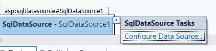

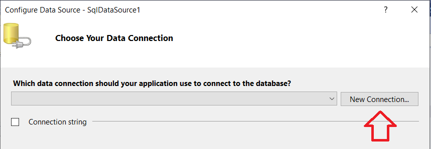

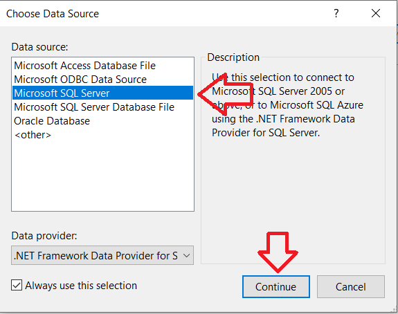

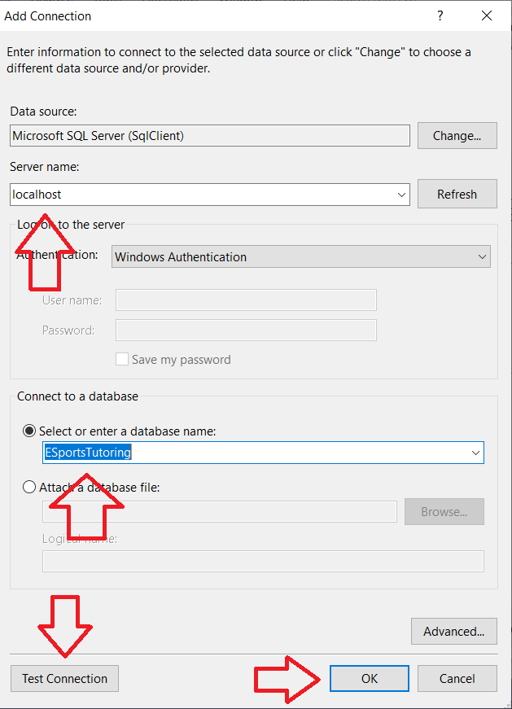

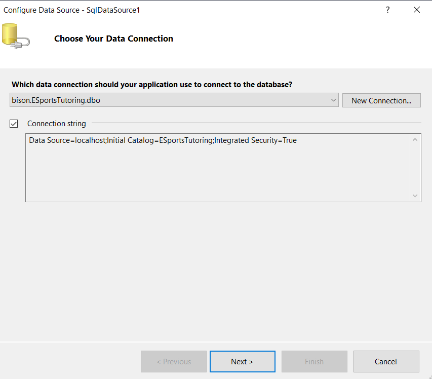

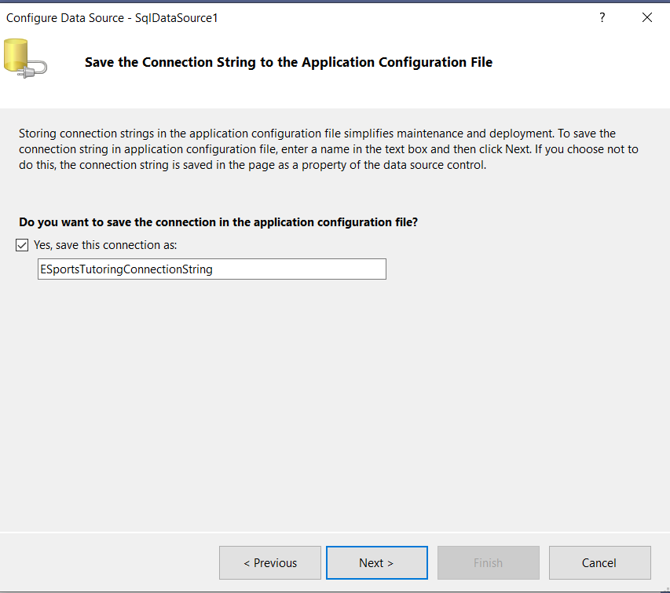

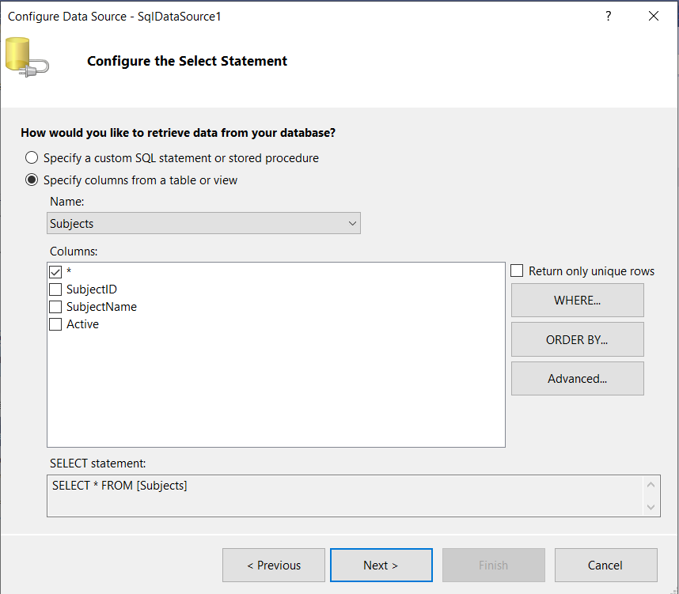

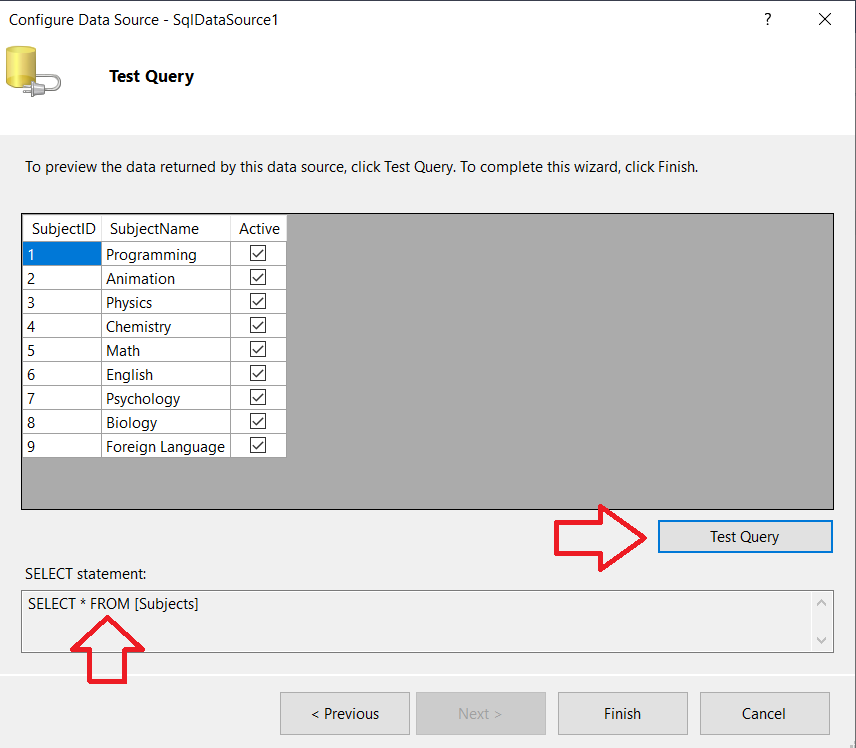

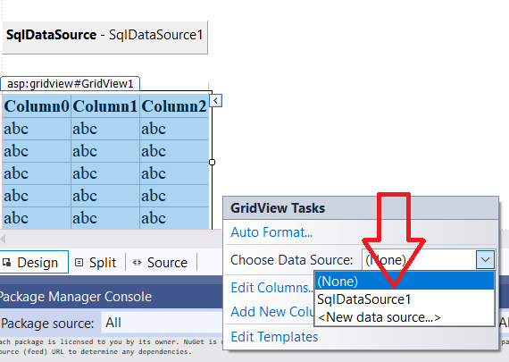

After connecting to the data source, the GridView looks like this.

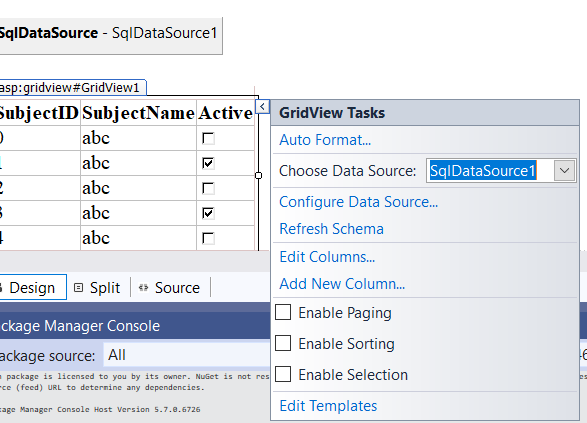

This is the end result!

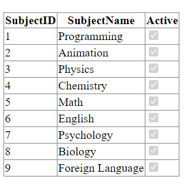